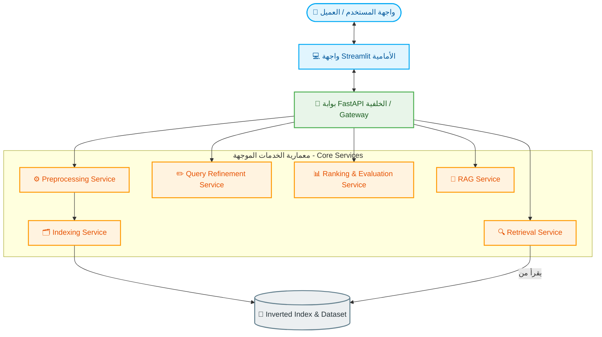

<div align="center">

# 🧬 CORD-19 Information Retrieval System

<p align="center">
  
  
  
  
</p>

**نظام متكامل لاسترجاع المعلومات مصمم خصيصاً للتعامل مع أبحاث كوفيد-19 (CORD-19)** *يعتمد على معمارية الخدمات الموجهة (SOA) لضمان أداء عالي، مرونة فائقة، وقابلية للتوسع.*

</div>

---

## 🏗️ المعمارية البرمجية (System Architecture)

يعتمد النظام على مبدأ **فصل المسؤوليات (Separation of Concerns)** بين خدمات مستقلة تماماً تتواصل فيما بينها عبر بروتوكول `REST API` لإتمام دورة حياة الاستعلام والبحث:



### 🧩 تفصيل الخدمات (Services Breakdown)

* **`Preprocessing Service`**: مسؤولة عن تنظيف النصوص ومعالجتها الأولية عبر تقنيات (Normalization, Stemming, Lemmatization) لتوحيد صيغ الكلمات.
* **`Indexing Service`**: مسؤولة عن بناء الفهارس المقلوبة (Inverted Index) بفاعلية عالية وتخزينها لضمان سرعة الوصول.
* **`Retrieval Service`**: محرك البحث الهجين الذي يدمج بين النماذج الإحصائية التقليدية والنماذج الدلالية الحديثة مثل `TF-IDF` و `BM25` و `Dense Embeddings`.
* **`Query Refinement Service`**: تحسين وتصحيح استعلامات المستخدم تلقائياً عبر التصحيح الإملائي واقتراح المرادفات لرفع دقة البحث.
* **`Ranking & Evaluation Service`**: نظام التقييم المسؤول عن حساب مقاييس الأداء الأكاديمية بدقة لتحديد جودة النتائج باستخدام مقاييس: `MAP`, `Recall`, `P@10`, `nDCG`.
* **`RAG Service`**: دمج التوليد المدعم بالاسترجاع (Retrieval-Augmented Generation) لتلخيص الأبحاث المسترجعة وتوليد إجابات دقيقة وموثوقة علمياً.

---

## 🚀 المميزات الرئيسية (Key Features)

* **🧠 نماذج استرجاع هجينة ومتطورة**: دعم كامل للتمثيل التسلسلي (**Serial**) والمتوازي (**Parallel**) مع تطبيق تقنيات دمج النتائج (**Fusion Techniques**).
* **🔍 تحسين ذكي للاستعلامات**: معالجة الأخطاء الإملائية وتوسيع الاستعلام بالمرادفات الطبية لرفع دقة ومعدل الاستدعاء.
* **🎛️ واجهة تحكم تفاعلية متقدمة**: واجهة مستخدم تتيح للباحث والمصحح ضبط معاملات البحث الدقيقة والتبديل اللحظي بين نماذج البحث المتوفرة.
* **✨ ميزات إضافية نوعية**: تطبيق تقنيات التجميع (**Clustering**) لتصنيف الأبحاث، ونظام **RAG** متطور معتمد على نموذج **Gemini 2.5 Flash** لتقديم إجابات ذكية مدعومة بالمصادر الطبية.

---

## 🛠️ دليل التشغيل (Deployment Guide)

اتبع الخطوات التالية لتشغيل النظام محلياً على جهازك:

### 1️⃣ تثبيت المتطلبات وبيئة العمل

قم بإنشاء بيئة افتراضية وتثبيت الحزم البرمجية المطلوبة:

```bash
pip install -r requirements.txt
```

### 2️⃣ تشغيل الخدمة الخلفية (Backend API)

قم بتشغيل خادم FastAPI الذي يربط كافة الخدمات الموجهة:

```bash
python -m uvicorn api:app --host 0.0.0.0 --port 8000 --reload
```

### 3️⃣ تشغيل الواجهة الأمامية (Frontend Dashboard)

في نافذة طرفية (Terminal) جديدة، قم بإطلاق واجهة المستخدم التفاعلية:

```bash
python -m streamlit run app.py
```

> 💡 **ملاحظة هامة**: تأكد من إعداد مفاتيح البيئة الخاصة بواجهات برمجة التطبيقات (مثل `GEMINI_API_KEY`) في ملف `.env` قبل التشغيل للاستفادة من ميزات الـ RAG.

---

## 👥 فريق العمل (Project Team)

تم إنجاز هذا المشروع بجهود جماعية من قبل:

* 👤 **محمد عبدالرحمن علي**
* 👤 **صبا صابر أبو سرحان**
* 👤 **عبدالحميد ماهر رزق**
* 👤 **يزن احمد جهادي**
* 👤 **أريج عبدالقادر الرفاعي**

---

## 🎓 معلومات إشرافية وأكاديمية

* **🏫 المؤسسة:** كلية الهندسة المعلوماتية / قسم هندسة البرمجيات ونظم المعلومات.
* **📘 المادة:** نظم استرجاع المعلومات (Information Retrieval Systems).
* **📅 السنة الدراسية:** 2026.
* **👨‍🏫 مدرس القسم النظري:** د. أبي صندوق.
* **👩‍🏫 مدرسو القسم العملي:** م. مروة الداية ، م. سليمى المحايري.